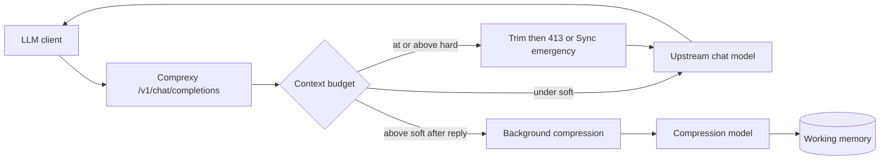

# Comprexy

**Comprexy™ is an OpenAI-compatible comprehension and context compression proxy for LLMs.** It keeps long-running chats and coding agents coherent by folding older turns into a rolling, versioned working memory without blocking every reply.

It sits between your client (Cursor, CLI agents, custom apps) and any OpenAI-compatible upstream. Soft budget pressure triggers **background** compression. 

At or above the hard budget, the default is send-time trim then HTTP 413 (no blocking emergency compact); set `EmergencyCompression` to `Sync` to restore synchronous emergency compression before the call goes out.

[Features](#features) · [Quick start](#quick-start) · [How it works](#how-it-works) · [Configuration](#configuration) · [Limitations](#limitations) · [Architecture](#architecture) · [Contributing](#contributing)


## Why Comprexy?

Long sessions accumulate history, tool output, and corrections until the prompt is noisy, expensive, or past the model’s useful window. Restarting and re-explaining kills flow; summarizing on every turn adds latency.

Comprexy’s approach:

| Goal | Approach |
| --- | --- |
| Stay in flow | Answer first; compact in the background when possible |
| Preserve what matters | LLM-written rolling working memory, not blind truncation |
| Stay compatible | OpenAI-compatible `/v1` base URL: chat completions are compressed; other `/v1/*` routes proxy upstream |
| Stay focused | Context compression only — not a multi-provider gateway or agent framework |

If you need routing, spend tracking, or broad agent wrappers, tools like LiteLLM or Headroom may fit better. Comprexy is intentionally narrower.

## Features

| Feature | Description |
| --- | --- |
| OpenAI-compatible `/v1` | `POST /v1/chat/completions` is compressed (roles: `system` / `user` / `assistant` / `tool`). Other `/v1/*` routes reverse-proxy to `Provider` unchanged |
| Rolling working memory | Older context compressed into a versioned summary the model can trust |
| Soft / hard budgets | Soft (`> soft`) → queue compression after the response. By default chat waits for in-flight soft compression (`CancelBackgroundCompressionOnChat: false`); set it `true` to cancel soft compression when the next chat request arrives. Soft prefers a **full-raw** rebuild when stored message tokens ≤ `CompressionMaxInputTokens`; otherwise merges into working memory. Hard (`>= hard`) → send-time retain trim then HTTP 413 by default (`EmergencyCompression: Off`). Set `EmergencyCompression: Sync` for blocking emergency compact before trim/413. Token estimates use tiktoken for text and OpenAI-style vision tiles for `image_url` (base64 is not BPE-counted) |
| Transparent until first memory | Before working memory exists, client messages pass through unchanged |
| Conversation identity | Prefer a unique `X-Comprexy-Conversation-Id` per session; otherwise fingerprint from system + first two user messages |
| Local-first, cloud-ready | Point `Provider` at Ollama, LM Studio, vLLM, OpenAI, Azure OpenAI–compatible APIs, and similar |
| Optional separate compress model | Use a cheaper/faster model for compression via `Compression` settings |
| Pass-through mode | `Proxy:PassThrough` forwards the original body unmodified — no rebuild, compression, or 413 budget gate. Escape hatch only; leave off for normal use |
| Strip reasoning | `Proxy:StripReasoningContent` (default on) removes `reasoning_content` / `reasoning` from outbound chat and compression messages |
| Request audit files | Optional per-request / per-compression logs under `logs/requests/` (opt in via `appsettings.Local.json`) |
| SQLite persistence | Conversations, messages, and working memory in a local DB |

## Quick start

**Requirements:** [.NET 10 SDK](https://dotnet.microsoft.com/download)

```bash
git clone https://github.com/norielmallari/comprexy.git
cd comprexy
```

Configure upstream in `src/Comprexy.Api/appsettings.json`, or copy `appsettings.Local.json.example` → `appsettings.Local.json` for machine-local settings (preferred for keys):

```json
{
  "Provider": {
    "BaseUrl": "http://localhost:11434/v1",
    "ApiKey": null,
    "Model": "your-model"
  }
}
```

```bash
dotnet run --project src/Comprexy.Api
```

On first run, Comprexy applies EF Core migrations and creates `comprexy.db` next to the API project. Default listen URL: `http://localhost:8129`.

Point any OpenAI-compatible client at:

```text
Base URL:  http://localhost:8129/v1
API key:   any value, or omit (or Auth:RequiredApiKey if set)
```

```bash
curl http://localhost:8129/v1/chat/completions \
  -H "Content-Type: application/json" \
  -d '{
    "model": "client-model",
    "messages": [
      {"role": "system", "content": "You are a helpful coding assistant."},
      {"role": "user", "content": "Let'\''s build a REST API."}
    ]
  }'
```

On the normal path, Comprexy replaces `model` with `Provider:Model`. In `Proxy:PassThrough` mode, the client body (including `model`) is forwarded as sent.

## How it works



**Normal path:** rebuild prompt → forward → return (or stream) → if above soft limit, enqueue compression. Soft compression and chat for the same conversation are serialized by a gate. With `CancelBackgroundCompressionOnChat: false` (default), chat waits until soft compression finishes. With `true`, an arriving chat request cancels in-flight soft compression and continues with last known-good working memory (or full client history if none exists yet). Soft jobs rebuild from the full raw transcript when it fits `CompressionMaxInputTokens`; otherwise they merge a fold segment into working memory. Soft and emergency compression both require closed tool chains (every assistant `tool_call` id has a matching tool result); while tools are open, compression is skipped and recovery is the next closed turn (or send-time trim / 413 under hard pressure).

**Hard path (default `EmergencyCompression: Off`):** at or above hard → temporary send-time retain trim → forward if under budget, else HTTP 413. Soft background compression is the recovery path for the next turn.

**Hard path (`EmergencyCompression: Sync`):** at or above hard → bounded synchronous emergency compact when tool chains are closed → send-time retain trim if needed → forward, or HTTP 413 if still over. Emergency compaction is skipped while tool calls are open.

**After working memory exists:** outgoing context is roughly `system + working memory + still-unfolded messages + current tip`. The retain window is applied at compression time. An additional send-time retain trim runs when the hard limit is still exceeded (it does not permanently fold messages).

## Configuration

Settings load in order: `appsettings.json` → `appsettings.{Environment}.json` → optional `appsettings.Local.json` → user secrets / environment variables / command line (host defaults). Host defaults can override keys set in `appsettings.Local.json`.

| Section | Role |
| --- | --- |
| `Provider` | Upstream OpenAI-compatible chat endpoint (`BaseUrl`, `ApiKey`, `Model`, `TimeoutSeconds`) |
| `Compression` | Optional compression endpoint; falls back to `Provider`. `TimeoutSeconds` often longer than chat (default 600). `EnableThinking` (default false) sets `chat_template_kwargs.enable_thinking` on compression calls. `InstructionFile` is the Fixed compression system prompt (`Prompts/compression-fixed.md`); `SmartInstructionFile` is the Smart trailing user instruction (`Prompts/compression-smart.md`, live prefix + retain index) |
| `ContextPolicy` | Soft/hard token limits, `CompressionMaxInputTokens`, `EmergencyCompression` (`Off` default / `Sync`), `CancelBackgroundCompressionOnChat` (default false — chat waits; `true` cancels soft compression on chat), `RetainSelection` (`Fixed` default / `Smart`), Fixed retain counts (`CompressionRetainMessageCount` / `EmergencyRecentMessageCount` default `1` = tip only; `MaxRecentRawTokens`), Smart caps (`SmartRetainMaxMessages`, `SmartRetainMaxTokens`), `DedupeDuplicateFileReads` (default true), tokenizer encoding |
| `Auth` | Optional `RequiredApiKey` — Bearer or `X-Api-Key` required on `/v1/*` only; `/` and `/health` stay open |
| `Proxy` | `PassThrough` skips rebuild, compression, and hard-limit enforcement (raw forward). `StripReasoningContent` (default true) drops `reasoning_content` / `reasoning` from messages before chat and compression upstream calls |
| `Trace` | Console payload categories (need `Logging:LogLevel:Comprexy` = `Trace`) and/or `RequestFiles` for audit files. `MaxPayloadChars: 0` means no truncation |
| `ConnectionStrings:Comprexy` | SQLite path (default `Data Source=comprexy.db;Cache=Shared`). WAL + 5s busy timeout are applied on connect |

**Conversation id:** send a unique `X-Comprexy-Conversation-Id` per logical session when multiple clients or tabs might share the same opening prompt. If omitted, Comprexy fingerprints system + first two user message texts (templated openings can still collide). The resolved id is echoed on the response.

**Local overrides:** copy `src/Comprexy.Api/appsettings.Local.json.example` to `src/Comprexy.Api/appsettings.Local.json` (gitignored). Use it for upstream URL/key/model and to enable full request audit files (`RequestFiles: true`, `MaxPayloadChars: 0`). Omit keys you do not want to override.

**Development defaults:** quiet console (`Comprexy` = `Information`) and `RequestFiles: false`. Base config also leaves request files off with `MaxPayloadChars: 32768`.

## Limitations

- Chat compression supports `system`, `user`, `assistant`, and `tool` roles. Other roles (for example `developer`) are rejected on `/v1/chat/completions`.
- Without `X-Comprexy-Conversation-Id`, conversation identity is a text fingerprint of the system prompt and first two user messages. Use an explicit id for multi-tab or multi-user setups.
- After working memory exists, the system prompt captured on the first turn is reused when rebuilding context.
- `Proxy:PassThrough` disables context management entirely, including the hard-limit 413 gate.
- compression runs in-process; the in-memory queue is not shared across multiple API instances.

Deferred work is tracked in [`docs/TODO.md`](docs/TODO.md).

## Architecture

Layering, request lifecycle, compression ownership, and persistence are documented in [`docs/ARCHITECTURE.md`](docs/ARCHITECTURE.md).

## Security

Treat API keys and request audit logs as sensitive. Prefer `appsettings.Local.json`, environment variables, or user secrets for `Provider:ApiKey`, `Compression:ApiKey`, and `Auth:RequiredApiKey`. Comprexy forwards traffic only to the configured upstream(s) — review those endpoints and what clients send. See [`CONTRIBUTING.md`](CONTRIBUTING.md#security) for contributor hygiene (what not to commit or share).

## AI-assisted development

Much of this repository was produced with AI coding assistants under human direction. Maintainers review and are responsible for what ships. See [`CONTRIBUTING.md`](CONTRIBUTING.md#ai-assisted-development) for how to treat PRs and docs.

## Contributing

Issues and pull requests are welcome. See [`CONTRIBUTING.md`](CONTRIBUTING.md) for build, test, database, and migration notes.

## License

[MIT](LICENSE)

## Trademark & Copyright

Comprexy™ is a trademark claimed by Noriel Mallari. © 2026 Noriel Mallari.

The MIT License applies strictly to the software source code. It does not grant permission to use the Comprexy name, logo, or branding to identify, market, or promote any separate, modified, or derivative product.