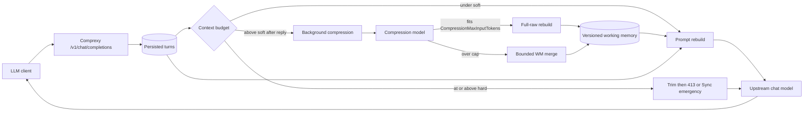

# Comprexy

**Comprexy™ is an OpenAI-compatible comprehension and context compression proxy for LLMs.** It keeps long-running chats and coding agents coherent by folding older turns into a rolling, versioned working memory without blocking every reply.

It sits between your client (Cursor, CLI agents, custom apps) and any OpenAI-compatible upstream. Soft budget pressure triggers **background** compression. 

At or above the hard budget, the default is send-time trim then HTTP 413 (no blocking emergency compact); set `EmergencyCompression` to `Sync` to restore synchronous emergency compression before the call goes out.

[Quick start](#quick-start) · [MCP setup](#mcp-setup) · [Source of truth](#source-of-truth) · [Why Comprexy?](#why-comprexy) · [Features](#features) · [How it works](#how-it-works) · [Configuration](#configuration) · [Limitations](#limitations) · [Architecture](#architecture) · [Contributing](#contributing)


## Source of truth

Comprexy persists completed conversation turns as the durable record. Working memory is a derived, versioned representation used to construct bounded upstream prompts. Compression marks messages as folded; it does not delete or replace them.

Soft compression rebuilds working memory from the full transcript when it fits `CompressionMaxInputTokens`. Beyond that cap, Comprexy intentionally merges a bounded fold segment into existing working memory, avoiding unbounded compression requests that can overwhelm local LLMs. Set `CompressionMaxInputTokens` to `null` to remove the input bound (soft compression then always prefers full-raw rebuild); compression itself still runs.

## Quick start

**Requirements:** [.NET 10 SDK](https://dotnet.microsoft.com/download)

```bash
git clone https://github.com/norielmallari/comprexy.git
cd comprexy
```

Configure upstream in `apps/proxy/appsettings.json`, or copy `appsettings.Local.json.example` → `appsettings.Local.json` for machine-local settings (preferred for keys):

```json
{
  "Provider": {
    "BaseUrl": "http://localhost:11434/v1",
    "ApiKey": null,
    "Model": "your-model"
  }
}
```

Omit `Model` (or set it `null`) to forward the client's `model` field instead. Soft/emergency compression then reuses that same client model unless `Compression:Model` is set.

```bash
./comprexy.sh proxy          # data plane :8129
./comprexy.sh control-api    # metrics    :8130
./comprexy.sh dev            # both (Ctrl-C stops both)
```

Windows (PowerShell or cmd):

```bat
.\comprexy.cmd proxy
.\comprexy.cmd control-api
.\comprexy.cmd dev
```

If .NET 10 is missing, the script prompts to install the SDK into `~/.dotnet` (or `%USERPROFILE%\.dotnet` on Windows) via the official Microsoft install script. Use `install-dotnet` or `COMPREXY_AUTO_INSTALL_DOTNET=1` for non-interactive installs.

On first run, Comprexy applies EF Core migrations and creates `data/comprexy.db` under the repo root (shared with control-api). Proxy listen URL: `http://localhost:8129`. Control-api: `http://localhost:8130` (e.g. `GET http://localhost:8130/v1/comprexy/conversations`).

Equivalent `dotnet run --project apps/proxy` / `apps/control-api` commands still work; `./comprexy.sh help` / `.\comprexy.cmd help` lists shortcuts (`test`, `build`, `clear-db`).

Point any OpenAI-compatible client at:

```text
Base URL:  http://localhost:8129/v1
API key:   any value, or omit (or Auth:RequiredApiKey if set)
```

```bash
curl http://localhost:8129/v1/chat/completions \
  -H "Content-Type: application/json" \
  -d '{
    "model": "client-model",
    "messages": [
      {"role": "system", "content": "You are a helpful coding assistant."},
      {"role": "user", "content": "Let'\''s build a REST API."}
    ]
  }'
```

On the normal path, when `Provider:Model` is set Comprexy replaces `model` with that value; when it is null/omitted, the client's `model` is forwarded. In `Proxy:PassThrough` mode, the client body (including `model`) is forwarded as sent unless `Provider:Model` overrides it.

## MCP setup

Control-api exposes read-only conversation telemetry over MCP Streamable HTTP. Any IDE, coding agent, or MCP client that supports remote Streamable HTTP can connect to:

```text
http://localhost:8130/mcp
```

Start control-api directly or alongside the proxy:

```bash
./comprexy.sh control-api
# or
./comprexy.sh dev
```

Add a remote MCP server named `comprexy-telemetry` in your client's MCP settings using that URL. For clients that use the common `mcpServers` JSON shape:

```json
{
  "mcpServers": {
    "comprexy-telemetry": {
      "url": "http://localhost:8130/mcp"
    }
  }
}
```

For Cursor, the repository includes this configuration in `.cursor/mcp.json`. Other IDEs may use a different settings file or UI; use the same server URL and Streamable HTTP transport.

Reload the MCP client after starting control-api. If `Auth:RequiredApiKey` is configured, add an HTTP header through the client's secret or environment-variable support:

```json
{
  "mcpServers": {
    "comprexy-telemetry": {
      "url": "http://localhost:8130/mcp",
      "headers": {
        "Authorization": "Bearer <api-key>"
      }
    }
  }
}
```

Telemetry MCP tools are named `comprexy_*` and require `conversationId` from the proxy meta-tool `comprexy_get_current_conversation_id` (or from operator tooling / response header `X-Comprexy-Conversation-Id`).

## Why Comprexy?

Long sessions accumulate history, tool output, and corrections until the prompt is noisy, expensive, or past the model’s useful window. Restarting and re-explaining kills flow; summarizing on every turn adds latency.

Comprexy’s approach:

| Goal | Approach |
| --- | --- |
| Stay in flow | Answer first; compact in the background when possible |
| Preserve what matters | Persist completed turns; use versioned working memory for the active prompt, not blind truncation |
| Stay compatible | OpenAI-compatible `/v1` base URL: chat completions are compressed; other `/v1/*` routes proxy upstream |
| Stay focused | Context compression only — not a multi-provider gateway or agent framework |

If you need routing, spend tracking, or broad agent wrappers, tools like LiteLLM or Headroom may fit better. Comprexy is intentionally narrower.

## Features

| Feature | Description |
| --- | --- |
| OpenAI-compatible `/v1` | `POST /v1/chat/completions` is compressed (roles: `system` / `user` / `assistant` / `tool`). Other `/v1/*` routes reverse-proxy to `Provider` unchanged |
| Token metrics API | Control API `GET /v1/comprexy/conversations` (+ `/metrics`, `/metrics/turns`) on `:8130` reports raw vs compressed token savings per conversation |
| Telemetry MCP | Control API `/mcp` exposes read-only summaries, turns, compression phases, budget events, prompt growth, comparisons, evidence markdown, and conversation retrieval (search / message window / working memory / open tool chains) to MCP clients |
| Rolling working memory | Versioned compressed representation of older context for prompt reconstruction. Derived from persisted messages; may incorporate earlier working memory when the transcript exceeds `CompressionMaxInputTokens` |
| Soft / hard budgets | Soft (`> soft`) → Inline follow-up wrap-up on eligible turns by default (`RetainSelection=Inline`); Fixed/Smart queue background compression instead. By default chat waits for in-flight soft compression (`CancelBackgroundCompressionOnChat: false`); set it `true` to cancel soft compression when the next chat request arrives. Soft Fixed/Smart prefer a **full-raw** rebuild when stored message tokens ≤ `CompressionMaxInputTokens`; otherwise intentionally merge a bounded fold segment into working memory. Hard (`>= hard`) → send-time retain trim then HTTP 413 by default (`EmergencyCompression: Off`). Set `EmergencyCompression: Sync` for blocking Fixed-style emergency compact before trim/413 (Fixed/Smart only; ignored under Inline — see TODO-013). Token estimates use tiktoken for text and OpenAI-style vision tiles for `image_url` (base64 is not BPE-counted) |
| Transparent until first memory | Before working memory exists, client messages pass through unchanged |
| Conversation identity | Prefer a unique `X-Comprexy-Conversation-Id` per session; otherwise fingerprint from system + first two user messages |
| Local-first, cloud-ready | Point `Provider` at Ollama, LM Studio, vLLM, OpenAI, Azure OpenAI–compatible APIs, and similar |
| Optional separate compress model | Use a cheaper/faster model for compression via `Compression` settings |
| Pass-through mode | `Proxy:PassThrough` forwards the original body unmodified — no rebuild, compression, or 413 budget gate. Escape hatch only; leave off for normal use |
| Strip reasoning | `Proxy:StripReasoningContent` (default off) removes `reasoning_content` / `reasoning` from outbound chat and compression messages when enabled |
| Request audit files | Optional per-request / per-compression logs under `logs/requests/` (opt in via `appsettings.Local.json`) |
| Local persistence | Persists completed conversation turns, working-memory versions, metrics, and compression history. Raw turns remain available after compression |

## How it works


```mermaid
flowchart LR
  Client[LLM client] --> Proxy["Comprexy /v1/chat/completions"]
  Proxy --> Store[(Persisted turns)]
  Store --> Budget{Context budget}
  Budget -->|under soft| Rebuild[Prompt rebuild]
  Budget -->|above soft after reply| Queue[Background compression]
  Budget -->|at or above hard| HardPath[Trim then 413 or Sync emergency]
  Queue --> Compress[Compression model]
  Compress -->|fits CompressionMaxInputTokens| FullRaw[Full-raw rebuild]
  Compress -->|over cap| Merge[Bounded WM merge]
  FullRaw --> WM[(Versioned working memory)]
  Merge --> WM
  WM --> Rebuild
  Store --> Rebuild
  Rebuild --> Upstream[Upstream chat model]
  HardPath --> Upstream
  Upstream --> Client
```

**Normal path:** rebuild prompt → forward → return (or stream) → if above soft limit, enqueue compression. Soft compression and chat for the same conversation are serialized by a gate. With `CancelBackgroundCompressionOnChat: false` (default), chat waits until soft compression finishes. With `true`, an arriving chat request cancels in-flight soft compression and continues with last known-good working memory (or full client history if none exists yet). Soft jobs rebuild from the full transcript when it fits `CompressionMaxInputTokens`; otherwise they intentionally merge a bounded fold segment into existing working memory. Soft and emergency compression both require closed tool chains (every assistant `tool_call` id has a matching tool result); while tools are open, compression is skipped and recovery is the next closed turn (or send-time trim / 413 under hard pressure).

**Hard path (default `EmergencyCompression: Off`):** at or above hard → temporary send-time retain trim → forward if under budget, else HTTP 413. Soft background compression is the recovery path for the next turn.

**Hard path (`EmergencyCompression: Sync`):** at or above hard → bounded synchronous emergency compact when tool chains are closed → send-time retain trim if needed → forward, or HTTP 413 if still over. Emergency compaction is skipped while tool calls are open.

**After working memory exists:** outgoing context is roughly `system + working memory + still-unfolded messages + current tip`. The retain window is applied at compression time. An additional send-time retain trim runs when the hard limit is still exceeded (it does not permanently fold messages).

### What compression does

Compression in Comprexy:

- Reduces the active upstream prompt.
- Creates versioned working memory.
- Marks represented messages as folded.
- Retains persisted message records.
- Uses bounded incremental merging when the transcript exceeds `CompressionMaxInputTokens`.

Compression does not delete persisted turns, replace the durable transcript, or wait for summarization on every reply.

## Configuration

Settings load from `appsettings.json`, environment overlays, and optional gitignored `appsettings.Local.json`. See **[`docs/SETTINGS.md`](docs/SETTINGS.md)** for the full reference (Provider, Compression, ContextPolicy, **ToolSchema**, Auth, Proxy, Trace, token cache, SQLite).

| Section | Role (summary) |
| --- | --- |
| `Provider` | Upstream OpenAI-compatible chat endpoint |
| `Compression` | Optional separate compression model/prompts |
| `ContextPolicy` | Soft/hard token limits, retain, emergency compression |
| `ToolSchema` | Virtual Tools (`Mode: Virtual` default; set `Off` to disable) |
| `McpTelemetry` | Control-api MCP row limits and query timeout |
| `Auth` | Optional API key gate on `/v1/*` and control-api `/mcp` |
| `Proxy` | Pass-through and reasoning strip |
| `Trace` | Console payload trace and request audit files |
| `ConnectionStrings:Comprexy` | SQLite path |

**Conversation id:** prefer `X-Comprexy-Conversation-Id` per session; otherwise fingerprint from system + first two user messages (see SETTINGS.md).

## Limitations

- Chat compression supports `system`, `user`, `assistant`, and `tool` roles. Other roles (for example `developer`) are rejected on `/v1/chat/completions`.
- Without `X-Comprexy-Conversation-Id`, conversation identity is a text fingerprint of the system prompt and first two user messages. Use an explicit id for multi-tab or multi-user setups.
- After working memory exists, the system prompt captured on the first turn is reused when rebuilding context.
- `Proxy:PassThrough` disables context management entirely, including the hard-limit 413 gate.
- compression runs in-process; the in-memory queue is not shared across multiple API instances.

Deferred work is tracked in [`docs/TODO.md`](docs/TODO.md).

## Architecture

Layering, request lifecycle, compression ownership, and persistence are documented in [`docs/ARCHITECTURE.md`](docs/ARCHITECTURE.md).

## Security

Treat API keys and request audit logs as sensitive. Prefer `appsettings.Local.json`, environment variables, or user secrets for `Provider:ApiKey`, `Compression:ApiKey`, and `Auth:RequiredApiKey`. Comprexy forwards traffic only to the configured upstream(s) — review those endpoints and what clients send. See [`CONTRIBUTING.md`](CONTRIBUTING.md#security) for contributor hygiene (what not to commit or share).

## AI-assisted development

Much of this repository was produced with AI coding assistants under human direction. Maintainers review and are responsible for what ships. See [`CONTRIBUTING.md`](CONTRIBUTING.md#ai-assisted-development) for how to treat PRs and docs.

## Contributing

Issues and pull requests are welcome. See [`CONTRIBUTING.md`](CONTRIBUTING.md) for build, test, database, and migration notes.

## License

[MIT](LICENSE)

## Trademark & Copyright

Comprexy™ is a trademark claimed by Noriel Mallari. © 2026 Noriel Mallari.

The MIT License applies strictly to the software source code. It does not grant permission to use the Comprexy name, logo, or branding to identify, market, or promote any separate, modified, or derivative product.