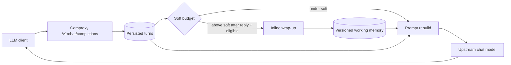

# Comprexy

OpenAI-compatible context compression proxy for long-running chats and coding agents.

**Comprexy™** sits between your client (Cursor, CLI agents, custom apps) and any OpenAI-compatible upstream. It persists completed turns, rebuilds a bounded upstream prompt from versioned **working memory** plus still-unfolded messages, and folds older context via **Inline** wrap-up when soft budget pressure applies — without summarizing on every reply.

Soft budget pressure triggers a blocking Inline follow-up wrap-up on eligible turns (closed stored tool chain + cooldown). Local-first by default: point `Provider` at Ollama, LM Studio, vLLM, or a cloud OpenAI-compatible endpoint.

[Quick start](#quick-start) · [Why Comprexy?](#why-comprexy) · [Design principles](#design-principles) · [What Comprexy is not](#what-comprexy-is-not) · [Source of truth](#source-of-truth) · [MCP setup](#mcp-setup) · [Features](#features) · [How it works](#how-it-works) · [Configuration](#configuration) · [Limitations](#limitations) · [Architecture](#architecture) · [Contributing](#contributing)


## Quick start

**Requirements:** [.NET 10 SDK](https://dotnet.microsoft.com/download)

```bash
git clone https://github.com/norielmallari/comprexy.git
cd comprexy
```

Configure upstream in `apps/proxy/appsettings.json`, or copy `appsettings.Local.json.example` → `appsettings.Local.json` for machine-local settings (preferred for keys):

```json
{
  "Provider": {
    "BaseUrl": "http://localhost:11434/v1",
    "ApiKey": null,
    "Model": "your-model"
  }
}
```

Omit `Model` (or set it `null`) to forward the client's `model` field instead. Inline wrap-up and ToolSchema mapping then reuse that same client model unless `Compression:Model` is set (mapper only).

```bash
./comprexy.sh proxy          # data plane :8129
./comprexy.sh control-api    # metrics    :8130
./comprexy.sh dev            # both (Ctrl-C stops both)
```

Windows (PowerShell or cmd):

```bat
.\comprexy.cmd proxy
.\comprexy.cmd control-api
.\comprexy.cmd dev
```

If .NET 10 is missing, the script prompts to install the SDK into `~/.dotnet` (or `%USERPROFILE%\.dotnet` on Windows) via the official Microsoft install script. Use `install-dotnet` or `COMPREXY_AUTO_INSTALL_DOTNET=1` for non-interactive installs.

On first run, Comprexy applies EF Core migrations and creates `data/comprexy.db` under the repo root (shared with control-api). Proxy listen URL: `http://localhost:8129`. Control-api: `http://localhost:8130` (e.g. `GET http://localhost:8130/v1/comprexy/conversations`).

Equivalent `dotnet run --project apps/proxy` / `apps/control-api` commands still work; `./comprexy.sh help` / `.\comprexy.cmd help` lists shortcuts (`test`, `build`, `clear-db`).

Point any OpenAI-compatible client at:

```text
Base URL:  http://localhost:8129/v1
API key:   any value, or omit (or Auth:RequiredApiKey if set)
```

```bash
curl http://localhost:8129/v1/chat/completions \
  -H "Content-Type: application/json" \
  -d '{
    "model": "client-model",
    "messages": [
      {"role": "system", "content": "You are a helpful coding assistant."},
      {"role": "user", "content": "Let'\''s build a REST API."}
    ]
  }'
```

On the normal path, when `Provider:Model` is set Comprexy replaces `model` with that value; when it is null/omitted, the client's `model` is forwarded. In `Proxy:PassThrough` mode, the client body (including `model`) is forwarded as sent unless `Provider:Model` overrides it.

## Why Comprexy?

Comprexy was built from a real local LLM limitation: long-running planning workflows in Cursor became impractical as context accumulated. History, tool output, and corrections pile up until each turn is noisy, expensive, or past the model’s useful window. On local runtimes, once the prompt crosses a size threshold, tokens-per-second often drops sharply — prefill gets heavier, streaming feels sticky, and the developer loop slows down even when the model could still answer. Restarting and re-explaining kills flow; summarizing on every turn adds latency; blind truncation drops decisions you still need.

Comprexy keeps the **sent** context manageable — stable information in versioned working memory, older context folded on soft budget pressure — so the model does not need the full accumulated history every turn. Smaller upstream prompts do not guarantee faster inference, but they help keep long sessions in a size range where local tok/s stays usable. The goal is simple: make long-running local LLM workflows practical.

### First validation

In one end-to-end planning run, Comprexy supported a 29-turn Cursor workflow on a local LLM that produced the [Comprexy Metrics Dashboard implementation plan](docs/plans/comprexy-dashboard-implementation-plan.md). The run accumulated an estimated 2.00M baseline tokens across all turns. After compression and trimming, the sent-equivalent volume was about 1.08M tokens (roughly 800k saved). On the final turn, the estimated payload dropped from about 94k baseline tokens to about 37k compressed tokens (77 raw messages → 31 sent); across the run, effective prompt size stayed roughly in the 21–58k range instead of climbing linearly toward ~93k. Full phase breakdown: [`docs/evidence/d2e0faa.md`](docs/evidence/d2e0faa.md). This is one dogfood workflow, not a universal benchmark — and it does not claim measured tok/s gains.

Comprexy’s approach:

| Goal | Approach |
| --- | --- |
| Stay in flow | Answer first; fold via Inline wrap-up on eligible soft-pressure turns so prompts stay smaller and local sessions stay responsive longer |
| Preserve what matters | Persist completed turns; use versioned working memory for the active prompt, not blind truncation |
| Stay compatible | OpenAI-compatible `/v1` base URL: chat completions are compressed; other `/v1/*` routes proxy upstream |
| Stay focused | Context compression only — not a multi-provider gateway or agent framework |

If you need routing, spend tracking, or broad agent wrappers, tools like LiteLLM or Headroom may fit better. Comprexy is intentionally narrower: chat-completion context management only.

## Design principles

- Answer first; fold on soft pressure when the stored tool chain is closed and cooldown allows.
- Persist the durable transcript; treat working memory as a derived, versioned prompt aid.
- Rebuild outgoing context from stored turns — do not forward an unmanaged client history as the model transcript.
- Prefer inspectable, deterministic behavior over opaque truncation.
- Stay local-first and OpenAI-compatible; stay narrow (context compression, not a gateway or agent framework).

## What Comprexy is not

- Not a model or LLM runtime — it proxies to your configured upstream.
- Not a multi-provider gateway, router, or billing layer.
- Not a vector database or retrieval framework.
- Not a static prompt minifier or offline context packer.
- Not a guarantee of better answers or higher tok/s; it manages prompt size and structure so long sessions stay usable.

## Source of truth

Comprexy persists completed conversation turns as the durable record. Working memory is a derived, versioned representation used to construct bounded upstream prompts. Compression marks messages as folded; it does not delete or replace them.

Soft pressure above `SoftLimitTokens` triggers a blocking Inline wrap-up on eligible turns. The wrap-up folds older unfolded messages into a new working-memory version while retaining a tip window (`CompressionRetainMessageCount` / `MaxRecentRawTokens`).

## MCP setup

Control-api exposes read-only conversation telemetry over MCP Streamable HTTP. Any IDE, coding agent, or MCP client that supports remote Streamable HTTP can connect to:

```text
http://localhost:8130/mcp
```

Start control-api directly or alongside the proxy:

```bash
./comprexy.sh control-api
# or
./comprexy.sh dev
```

Add a remote MCP server named `comprexy-telemetry` in your client's MCP settings using that URL. For clients that use the common `mcpServers` JSON shape:

```json
{
  "mcpServers": {
    "comprexy-telemetry": {
      "url": "http://localhost:8130/mcp"
    }
  }
}
```

For Cursor, the repository includes this configuration in `.cursor/mcp.json`. Other IDEs may use a different settings file or UI; use the same server URL and Streamable HTTP transport.

Reload the MCP client after starting control-api. If `Auth:RequiredApiKey` is configured, add an HTTP header through the client's secret or environment-variable support:

```json
{
  "mcpServers": {
    "comprexy-telemetry": {
      "url": "http://localhost:8130/mcp",
      "headers": {
        "Authorization": "Bearer <api-key>"
      }
    }
  }
}
```

Telemetry MCP tools are named `comprexy_*` and require `conversationId` from the proxy meta-tool `comprexy_get_current_conversation_id` (or from operator tooling / response header `X-Comprexy-Conversation-Id`).

## Features

| Feature | Description |
| --- | --- |
| OpenAI-compatible `/v1` | `POST /v1/chat/completions` is compressed (roles: `system` / `user` / `assistant` / `tool`). Other `/v1/*` routes reverse-proxy to `Provider` unchanged |
| Token metrics API | Control API `GET /v1/comprexy/conversations` (+ `/metrics`, `/metrics/turns`) on `:8130` reports raw vs compressed token savings per conversation |
| Telemetry MCP | Control API `/mcp` exposes read-only summaries, turns, compression phases, budget events, prompt growth, comparisons, evidence markdown, and conversation retrieval (search / message window / working memory / open tool chains) to MCP clients |
| Rolling working memory | Versioned compressed representation of older context for prompt reconstruction. Derived from persisted messages via Inline wrap-up |
| Soft budget | Soft (`> soft`) → Inline follow-up wrap-up on eligible turns (closed stored tool chain + `MinTurnsBetweenGenerations` cooldown). Token estimates use tiktoken for text and OpenAI-style vision tiles for `image_url` (base64 is not BPE-counted) |
| Context rebuild | Outgoing context is always rebuilt from stored turns (IR-side under Virtual Tools). Working memory is omitted until the first successful compression; `Proxy:PassThrough` is the only full bypass |
| Conversation identity | Prefer a unique `X-Comprexy-Conversation-Id` per session; otherwise fingerprint from system + first two **plain** user turns (Cursor `<user_query>` when present; tool-echo user turns skipped) |
| Local-first, cloud-ready | Point `Provider` at Ollama, LM Studio, vLLM, OpenAI, Azure OpenAI–compatible APIs, and similar |
| Optional separate compression model | Use a cheaper/faster model for compression via `Compression` settings |
| Pass-through mode | `Proxy:PassThrough` forwards the original body unmodified — no rebuild or compression. Escape hatch only; leave off for normal use |
| Strip reasoning | `Proxy:StripReasoningContent` (default off) removes `reasoning_content` / `reasoning` from outbound chat and compression messages when enabled |
| Request audit files | Optional per-request / per-compression logs under `logs/requests/` (opt in via `appsettings.Local.json`) |
| Local persistence | Persists completed conversation turns, working-memory versions, metrics, and compression history. Persisted message records remain available after folding |

## How it works


```mermaid
flowchart LR
  Client[LLM client] --> Proxy["Comprexy /v1/chat/completions"]
  Proxy --> Store[(Persisted turns)]
  Store --> Budget{Soft budget}
  Budget -->|under soft| Rebuild[Prompt rebuild]
  Budget -->|above soft after reply + eligible| SoftPath[Inline wrap-up]
  SoftPath --> WM[(Versioned working memory)]
  WM --> Rebuild
  Store --> Rebuild
  Rebuild --> Upstream[Upstream chat model]
  Upstream --> Client
```

**Normal path:** rebuild prompt → forward → return (or stream) → if above soft limit and eligible (closed stored tool chain + cooldown), run blocking Inline wrap-up under the exclusive conversation gate. Mid-chain turns may checkpoint the closed stored prefix while leaving an open assistant unfolded. Soft failure never overwrites last known-good working memory.

**After working memory exists:** outgoing context is roughly `system + working memory + still-unfolded messages + current tip`. The retain window is applied at Inline fold time.

### What compression does

Compression in Comprexy:

- Reduces the active upstream prompt.
- Creates versioned working memory.
- Marks represented messages as folded.
- Retains persisted message records.

Compression does not delete persisted turns, replace the durable transcript, or wait for summarization on every reply.

## Configuration

Settings load from `appsettings.json`, environment overlays, and optional gitignored `appsettings.Local.json`. See **[`docs/SETTINGS.md`](docs/SETTINGS.md)** for the full reference (Provider, Compression, ContextPolicy, **ToolSchema**, Auth, Proxy, Trace, token cache, SQLite).

| Section | Role (summary) |
| --- | --- |
| `Provider` | Upstream OpenAI-compatible chat endpoint |
| `Compression` | Optional separate Compression endpoint for ToolSchema mapper; Inline wrap-up prompts |
| `ContextPolicy` | Soft token limit, Inline cooldown / retain tip |
| `ToolSchema` | Virtual Tools (`Mode: Virtual` default; set `Off` to disable) |
| `McpTelemetry` | Control-api MCP row limits and query timeout |
| `Auth` | Optional API key gate on `/v1/*` and control-api `/mcp` |
| `Proxy` | Pass-through and reasoning strip |
| `Trace` | Console payload trace and request audit files |
| `ConnectionStrings:Comprexy` | SQLite path |

**Conversation id:** prefer `X-Comprexy-Conversation-Id` per session; otherwise fingerprint from system + first two plain user turns (see SETTINGS.md).

## Limitations

- Chat compression supports `system`, `user`, `assistant`, and `tool` roles. Other roles (for example `developer`) are rejected on `/v1/chat/completions`.
- Without `X-Comprexy-Conversation-Id`, conversation identity is a text fingerprint of the system prompt and first two **plain** user turns (Cursor `<user_query>` extraction when present; tool-echo user turns skipped). Use an explicit id for multi-tab or multi-user setups.
- After working memory exists, the system prompt captured on the first turn is reused when rebuilding context.
- `Proxy:PassThrough` disables context management entirely.
- Soft Inline wrap-up and the conversation gate are process-local; they are not shared across multiple API instances.

Deferred work is tracked in [`docs/TODO.md`](docs/TODO.md).

## Architecture

Layering, request lifecycle, compression ownership, and persistence are documented in [`docs/ARCHITECTURE.md`](docs/ARCHITECTURE.md).

## Security

Treat API keys and request audit logs as sensitive. Prefer `appsettings.Local.json`, environment variables, or user secrets for `Provider:ApiKey`, `Compression:ApiKey`, and `Auth:RequiredApiKey`. Comprexy forwards traffic only to the configured upstream(s) — review those endpoints and what clients send. See [`CONTRIBUTING.md`](CONTRIBUTING.md#security) for contributor hygiene (what not to commit or share).

## AI-assisted development

Much of this repository was produced with AI coding assistants under human direction. Maintainers review and are responsible for what ships. See [`CONTRIBUTING.md`](CONTRIBUTING.md#ai-assisted-development) for how to treat PRs and docs.

## Contributing

Issues and pull requests are welcome. See [`CONTRIBUTING.md`](CONTRIBUTING.md) for build, test, database, and migration notes.

## License

[MIT](LICENSE)

## Trademark & Copyright

Comprexy™ is a trademark claimed by Noriel Mallari. © 2026 Noriel Mallari.

The MIT License applies strictly to the software source code. It does not grant permission to use the Comprexy name, logo, or branding to identify, market, or promote any separate, modified, or derivative product.