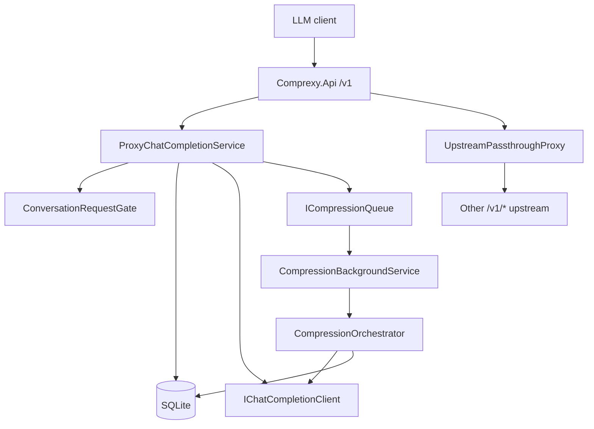

# Architecture

Contributor-oriented map of how Comprexy is structured and how a chat request moves through the system. Operator setup and config tables live in [`SETTINGS.md`](SETTINGS.md); deferred work lives in [`TODO.md`](TODO.md).

## Purpose

Comprexy is an OpenAI-compatible **context compression proxy**. It sits between an LLM client and an upstream `/v1` provider, persists conversation turns locally, and folds older history into a versioned **working memory** so long sessions stay within soft/hard token budgets without turning every reply into a blocking compact.

It is intentionally narrow: chat-completion context management only — not a multi-provider gateway, router, billing layer, or agent framework.

## Solution layout

```text
src/
  Comprexy.Api/              Minimal API host, DTOs, auth middleware, prompts
  Comprexy.Application/      Use cases, ports (abstractions), orchestration
  Comprexy.Domain/           Entities and enums (no infrastructure deps)
  Comprexy.Infrastructure/   EF Core/SQLite, HTTP upstream client, tokenizer, queue/worker

tests/
  Comprexy.Application.Tests/
```

| Layer | Responsibility |
| --- | --- |
| **Api** | Parse OpenAI-shaped JSON, map errors/status codes, stream SSE, optional API-key gate, composition root |
| **Application** | Conversation identity, prepare/complete chat, budget decisions, context rebuild, compression orchestration |
| **Domain** | `EntityBase`, `Conversation`, `ConversationMessage`, `WorkingMemory`, `CompressionEvent`, `ConversationToolCatalog`, `ConversationToolDefinition` and related enums |
| **Infrastructure** | Persistence, OpenAI-compatible HTTP client, tiktoken estimates, in-process compression queue + hosted worker |

Dependency rule: Api → Application → Domain; Infrastructure implements Application ports. Prefer constructor injection; register app services in `AddComprexyApplication`, adapters in `AddComprexyInfrastructure`.

## Runtime shape



- **Chat path:** `POST /v1/chat/completions` → `ProxyChatCompletionService` (rebuild, budget, compress hooks).
- **Passthrough path:** other `/v1/{**path}` → reverse-proxy to `Provider` unchanged.
- **Escape hatch:** `Proxy:PassThrough` forwards the original chat body with no rebuild, compression, or hard-budget 413.

## Chat request lifecycle

`ProxyChatCompletionService` owns one turn end to end.

1. **Identity** — `ConversationIdentityResolver`: prefer `X-Comprexy-Conversation-Id`; else fingerprint system + first two user message texts.
2. **Gate** — exclusive lease on the conversation key via `ConversationRequestGate` (serializes chat vs soft compression for that key).
3. **Prepare** — load/create conversation; stage new client messages; load latest working memory + unfolded messages; build outgoing context; optionally rewrite tools via ToolSchema; evaluate soft/hard budget; optionally run sync emergency compression; apply send-time retain trim when still over hard.
4. **Upstream** — non-stream `CompleteAsync` or stream with SSE; when ToolSchema is active, hydrate/meta rounds stay proxy-internal (streaming clients get live content/reasoning with meta `tool_calls` and early `[DONE]` suppressed until the final turn); model comes from `Provider:Model` when set, otherwise the client's request `model`.
5. **Complete** — persist assistant (and staged user) turns; if above soft limit and tool chains allow, enqueue soft compression (job carries the resolved chat model so compression still works when `Provider:Model` / `Compression:Model` are unset).

Persistence timing: new non-assistant messages are staged in prepare and saved in complete after a successful upstream call. Treat the DB as a record of completed turns unless that contract changes (see TODO-002).

### Outgoing context

After working memory exists, `ContextBuilder` assembles roughly:

`system (first-turn capture) + working-memory system message + still-unfolded raw messages (+ current tip)`

Before the first successful compression, client messages pass through without a working-memory section. Prefer `RawWireJson` on stored messages when rebuilding wire-faithful turns (tool_calls, multimodal parts).

## Budgets and compression

| Trigger | Behavior |
| --- | --- |
| Under soft | Forward; no compression enqueue |
| Above soft (after reply) | Enqueue soft job (`Background` / `HighPriorityBackground`) |
| At/above hard, `EmergencyCompression: Off` (default) | Send-time retain trim → forward if under budget, else HTTP 413 |
| At/above hard, `EmergencyCompression: Sync` | Sync emergency compact when tool chains are closed → trim if needed → forward or 413 |

Soft vs emergency:

- **Soft** (`CompressionOrchestrator`): prefer **full-raw** rebuild when total stored message tokens ≤ `CompressionMaxInputTokens`; otherwise merge a fold segment into existing working memory. Retain selection is `Fixed` (default) or `Smart` (soft-only; live chat prefix + retain-index instruction). Both Fixed and Smart retain keep assistant tool-call turns atomic with their tool results so rebuilt chat never starts a tool turn after working memory / user.
- **Emergency**: always bounded Fixed merge path; never Smart.
- **Working memory**: append-only versions. Failed compressions must not overwrite the last known-good version. Folding sets `ConversationMessage.FoldedIntoWorkingMemoryVersion`.

### Closed tool chains

Compression (soft and emergency) requires every assistant `tool_call` id in **unfolded** history to have a matching tool result. Open chains → orchestrator no-ops (skip fold / upstream compress). Send-time trim under hard pressure does not fold and is not gated the same way. Enforcement lives in `CompressionOrchestrator.RunAsync`.

### Soft / chat concurrency

`ConversationRequestGate` is process-local:

- Chat takes an **exclusive** lease.
- Soft compression takes a **preemptible** lease.
- `CancelBackgroundCompressionOnChat: false` (default): chat waits for soft work.
- `true`: arriving chat cancels in-flight soft compression and continues with last known-good memory (or full client history if none).

Jobs flow through `ChannelCompressionQueue` → `CompressionBackgroundService`. The queue is in-process only (not shared across API instances).

## Persistence

SQLite via EF Core (`ComprexyDbContext`). Default connection creates `comprexy.db` beside the API; WAL + busy timeout apply on connect. Migrations run at startup; `--clear-db` rebuilds from migrations.

Persisted rows inherit `EntityBase`: GUID `Id` is the primary key and app/FK identity (also returned on `X-Comprexy-Conversation-Id` for conversations). `ClusterId` (`long`) is a sequential surrogate for SQL Server clustering only — not used as domain identity. On SQLite, `ClusterIdSaveChangesInterceptor` assigns values; a future SQL Server provider should use IDENTITY + clustered index on `ClusterId` with a nonclustered GUID PK.

Message conversational order is `ConversationMessage.Sequence` (unique per conversation), not `CreatedAt` or `ClusterId`. Repositories load messages with `OrderBy(Sequence)`.

| Entity | Role |
| --- | --- |
| `Conversation` | Stable key, captured system prompt, `SyncedMessageCount` cursor |
| `ConversationMessage` | Ordered raw turns; optional wire JSON; fold marker; optional `IsPinnedForToolSchema` for meta hydrate turns |
| `WorkingMemory` | Immutable versioned markdown snapshot + token count |
| `CompressionEvent` | Attempt diagnostics (mode, status, tokens, duration, error) |
| `ConversationToolCatalog` | Per-conversation compact tool index snapshot (hash + JSON) |
| `ConversationToolDefinition` | Full tool definition JSON; `HydratedAt` set after meta-tool retrieval |

Natural indexes (in addition to the GUID PK and unique `ClusterId`): `ConversationKey`; `(ConversationId, Sequence)`; `(ConversationId, FoldedIntoWorkingMemoryVersion)`; `(ConversationId, Version)` on working memory; `(ConversationId, CreatedAt)` on compression events; unique `ConversationId` on tool catalog; unique `(ConversationId, ToolName)` on tool definitions.

## Tool schema (compact index)

When `ToolSchema:Mode` is `CompactIndex` (default; and `Proxy:PassThrough` is false):

1. **Parse & snapshot** — derive compact rows (`name`, `description`, `required`) from the client `tools[]`; persist catalog + full defs on first activation; on hash mismatch keep snapshot and log.
2. **Outbound rewrite** — inject stable system rules + compact index; outbound `tools` = `[get_tool_definition]`; token estimates use the rewritten payload.
3. **Meta loop** — upstream assistant meta calls execute locally; hydrate defs; synthetic JSON tool errors for invalid calls; bounded by `MaxHydrateRoundsPerRequest`. Streaming uses real upstream SSE (not a post-hoc dump): content forwards live; meta/invalid tool tails are held and dropped between rounds.
4. **Pin / re-insert** — meta assistant+tool turns persist with `IsPinnedForToolSchema`; compression fold and send-time trim never drop pinned messages; missing pins can be re-inserted from DB hydrated defs before upstream.
5. **Client boundary** — only allowed real tool_calls reach the client; downstream tool results must match open allowed `tool_call_id`s.

Prompt rules: `Comprexy.Api/Prompts/tool-schema.md`. Configuration: [`SETTINGS.md`](SETTINGS.md#toolschema).

## Supporting pieces

| Concern | Primary types |
| --- | --- |
| Token estimates | `ITokenEstimator` (tiktoken for text; OpenAI-style vision tiles for `image_url` — never BPE of base64) |
| Retain windows | `RecentContextSelector` (Fixed atomic groups), `SmartRetainResolver` / `RetainIndexBuilder` |
| Duplicate file reads | `DuplicateFileReadDeduper` + `FileReadPathExtractor` (soft path, when enabled) |
| Reasoning strip | `ReasoningContentStripper` before chat/compression upstream calls |
| Auth | `ApiKeyAuthMiddleware` — optional single `Auth:RequiredApiKey` on `/v1/*` only |
| Tracing | `IPayloadTraceLogger`, optional `IRequestTraceFileSession` under `logs/requests/` |
| Compression prompts | `Prompts/compression-fixed.md`, `Prompts/compression-smart.md` |
| Tool schema prompts | `Prompts/tool-schema.md` |

Repositories and `IUnitOfWork` live behind Application abstractions; implementations under `Infrastructure/Persistence`.

## Debugging with logs

When investigating prepare/upstream/complete failures, ToolSchema hydrate loops, budget 413s, or compression skips, **read the logs before guessing**. Prefer evidence from these sources (in order):

1. **API process console / host logs** — `Comprexy.*` categories (`ProxyChatCompletionService`, `ToolSchemaOrchestrator`, `CompressionOrchestrator`, etc.). Context budget lines, catalog hash mismatches, hydrate-round caps, and unhandled proxy errors appear here.
2. **Request audit files** — when `Trace:RequestFiles` is true, full per-request / per-compression payloads land under `Trace:RequestLogDirectory` (default `logs/requests/` beside the API content root). Payloads are formatted for human reading (relaxed escaping, multiline content blocks); use them for wire-level `tools`, messages, and upstream bodies.
3. **Payload trace categories** — `Trace:ClientInput`, `ModelInput`, `ContextBudget`, and related flags emit structured payload traces when `Logging:LogLevel:Comprexy` is `Trace` (see [`SETTINGS.md`](SETTINGS.md#trace)).

SQLite (`comprexy.db`) remains the source of truth for persisted turns, working memory versions, and tool-catalog snapshots after a turn completes; logs explain what happened on the path that produced them.

Do not invent parallel debug dumpers in Application code when these surfaces already cover the request. Toggle Trace/RequestFiles via `appsettings.Local.json` for local debugging.

## Configuration surfaces

Loaded as: `appsettings.json` → environment-specific → host defaults → optional gitignored `appsettings.Local.json`. Full tables: [`SETTINGS.md`](SETTINGS.md).

| Section | Owns |
| --- | --- |
| `Provider` | Upstream chat base URL, key, optional model (null → client `model`), timeout |
| `Compression` | Optional separate compress endpoint/model/prompts; falls back to Provider |
| `ContextPolicy` | Soft/hard limits, compression input cap, emergency mode, retain Fixed/Smart knobs |
| `ToolSchema` | Compact tool index mode, hydrate loop caps, skip-refetch, rules prompt path |
| `Proxy` | Pass-through; strip reasoning |
| `Auth` | Optional required API key |
| `Trace` | Console payload categories / request audit files |
| `ConnectionStrings:Comprexy` | SQLite path |

## Boundaries and constraints

- Supported chat roles on the compressed path: `system`, `user`, `assistant`, `tool`.
- Single-process compression queue and gate — multi-instance deploys do not share in-memory coordination.
- Fingerprint identity without `X-Comprexy-Conversation-Id` can collide across sessions that share the same opening text.
- After working memory exists, the first-turn system prompt is reused for rebuilds.
- Public docs stay operator/contributor-facing; design notes and adversarial writeups stay out of the public tree (e.g. gitignored `internal/`).

## Where to change what

| If you are changing… | Start here |
| --- | --- |
| HTTP contract, status codes, streaming | `Comprexy.Api/Program.cs`, mappers, middleware |
| Turn prepare/complete, budget gate, enqueue, tool-schema rewrite | `ProxyChatCompletionService`, `ToolSchemaOrchestrator` |
| Fold / WM versions / Soft FullRaw vs merge | `CompressionOrchestrator`, `CompressionPromptFactory` |
| Outgoing message assembly | `ContextBuilder`, `RecentContextSelector` |
| Identity / fingerprint | `ConversationIdentityResolver` |
| Schema / keys / indexes | `EntityBase`, EF configs under `Infrastructure/Persistence` (migrations via `dotnet ef` only) |
| Upstream HTTP / SSE parse | `OpenAiCompatibleChatCompletionClient`, streaming helpers |

When behavior or config defaults change, update [`SETTINGS.md`](SETTINGS.md) (and this document if the structural map drifts).
