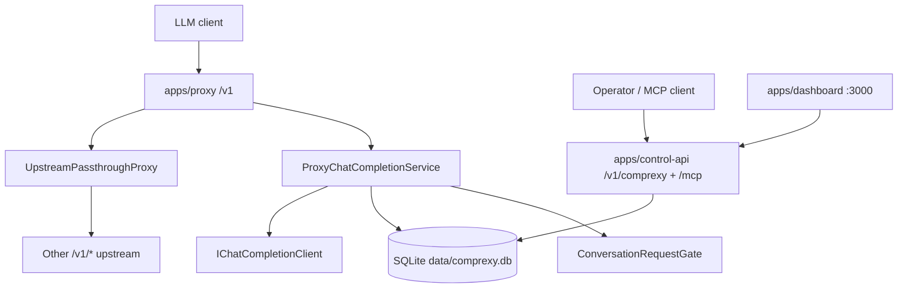

# Architecture

Contributor-oriented map of how Comprexy is structured and how a chat request moves through the system. Operator setup and config tables live in [`SETTINGS.md`](SETTINGS.md).

## Purpose

Comprexy OSS is an OpenAI-compatible **Comprehension Proxy**: it sits between an LLM client and an upstream `/v1` provider and manages what the model must comprehend each turn — bounded chat context plus the model-facing tool surface — so long sessions stay within a soft token budget on local or frontier endpoints.

It persists conversation turns locally and folds older history into a versioned **working memory** without turning every reply into a blocking compact. Under Virtual Tools (default): compact `comprexy_*` IR tools for file and shell families, optional operator denylist (`ExcludeFromModelTools`), deterministic remap to native client tools, and distilled IR observations in the stored transcript. **Client rules** extract Cursor/Kilo attached rule bodies each prepare, inject pending overlays outside the frozen Cache Alignment Prefix, and fold standing rules into WM `## Rules` on Inline accept.

Adjacent surfaces (same SQLite, separate hosts): control-api token metrics / telemetry MCP, optional dashboard UI, and the `Comprexy.Bench` harness for reproducible comparisons. Those surfaces observe and measure; they do not widen the chat path into a gateway or router.

It is intentionally narrow: chat-completion context management (including tool-surface management) only — not a multi-provider gateway, router, billing layer, or agent framework.

## Solution layout

```text
apps/
  proxy/                     # Data plane: Comprexy.Api host (`Endpoints/`), chat DTOs, prompts
  control-api/               # Control plane: REST metrics (`GET /v1/comprexy/*`) + telemetry MCP (`/mcp`)
  dashboard/                 # Optional Next.js metrics UI over control-api (`:3000`)
  website/                   # Marketing site (Next.js); not on the chat/metrics path
src/
  Comprexy.Application/      Use cases, ports (abstractions), orchestration
  Comprexy.Domain/           Entities and enums (no infrastructure deps)
  Comprexy.Infrastructure/   EF Core/SQLite, HTTP upstream client, tokenizer, shared hosting

tests/
  Comprexy.Application.Tests/
  Comprexy.ControlApi.Tests/
  Comprexy.Bench/               # Benchmark harness CLI (spawns proxy/control-api hosts; not a test suite)
  Comprexy.Bench.Conversations/ # Frozen prompt lists and the agent preamble for the harness
```

| Layer | Responsibility |
| --- | --- |
| **Proxy (`apps/proxy`)** | Parse OpenAI-shaped JSON, map errors/status codes, stream SSE, optional API-key gate, composition root for chat |
| **Control API (`apps/control-api`)** | Operator REST metrics and remote telemetry MCP (Streamable HTTP at `/mcp`); shares Application/Infrastructure and SQLite with the proxy. Operator control-api also owns local **benchmark orchestration** (`POST /v1/comprexy/benchmarks/runs`, file-backed registry under `reports/bench/`, single active-run lock). |
| **Dashboard (`apps/dashboard`)** | Optional browser UI for conversation metrics over control-api REST; does not talk to the proxy or SQLite directly |
| **Application** | Conversation identity, prepare/complete chat, soft-budget decisions, context rebuild, Inline wrap-up, Virtual Tools (ToolSchema / ToolIr), client rules (detect / consolidate / inject), token metrics / telemetry query facade, conversation retrieval (RAG) query facade |
| **Domain** | `EntityBase`, `Conversation`, `ConversationMessage`, `WorkingMemory`, `CompressionEvent`, `ConversationTurnMetric`, `ConversationMetricsSummary`, `ConversationToolCatalog`, `ConversationToolDefinition`, `ConversationToolCallMap` and related enums |
| **Infrastructure** | Persistence, OpenAI-compatible HTTP client, tiktoken estimates, shared API-key middleware |

Dependency rule: hosts → Application → Domain; Infrastructure implements Application ports. Prefer constructor injection; register app services in `AddComprexyApplication` (pass `enableProxyServices: false` on control-api), adapters in `AddComprexyInfrastructure`.

## Runtime shape


```mermaid
flowchart TB
  Client[LLM client] --> Api["apps/proxy /v1"]
  Api --> Proxy[ProxyChatCompletionService]
  Proxy --> Gate[ConversationRequestGate]
  Proxy --> DB[(SQLite data/comprexy.db)]
  Proxy --> Upstream[IChatCompletionClient]
  Api --> Pass[UpstreamPassthroughProxy]
  Pass --> Provider[Other /v1/* upstream]
  Ops[Operator / MCP client] --> Control["apps/control-api /v1/comprexy + /mcp"]
  Dashboard["apps/dashboard :3000"] --> Control
  Control --> DB
```

- **Chat path:** `POST /v1/chat/completions` → `ProxyChatCompletionService` (rebuild, soft budget, Inline wrap-up).
- **Metrics path:** `GET /v1/comprexy/conversations*` on **control-api** (`:8130`) → conversation token proof summaries and per-turn breakdown. Proxy emits/persists metrics; it does not serve query routes. SoftBudget headline figures use IrFull vs Prepared when IrFull is present; NativeRaw − IrFull is exposed as the virtual-tools / native-wire channel. The per-turn prepared-prompt split (system / working memory / history + tools) is derived read-side by `ConversationMetricsQueryService` from `Conversation.SystemPrompt` (BaseSystem only) and stored `WorkingMemory.TokenCount`; when BaseSystem was not captured, the system segment is `0`. Ephemeral injected rule tokens on the live path are not persisted and appear in the history/tools residual. Nothing extra is persisted per turn for rules, and the three parts sum to `CompressedInputTokensEstimated` so clients render them without re-deriving.
- **Benchmark path:** operator control-api (`/v1/comprexy/benchmarks/*`) spawns the `Comprexy.Bench` harness CLI, owns outer `status.json` phases and `reports/bench/index.json` for dashboard-started runs, and serves presentation/compare endpoints with separated I/O totals. The harness may write in-run progress fields only (`runPhase`, arm, conversation hints). Bench artifacts stay under `reports/bench/` — not in the product SQLite schema. CLI and dashboard share `reports/bench/.active-run.lock` (stale dead-pid reclaim); spawn fails fast if the fixed bench ports are already bound. Dashboard-spawned CLI runs pass `--under-orchestrator-lock` so they verify rather than re-acquire that lock.
- **Dashboard path:** optional `apps/dashboard` (`:3000`) browser UI over control-api REST (not the proxy). Enable CORS for the dashboard origin on control-api when needed.
- **Telemetry MCP path:** Streamable HTTP at `/mcp` on **control-api** — same Application read facades as REST (`IConversationMetricsQueryService` for metrics; `IConversationRetrievalQueryService` for message/WM RAG). Tools are `comprexy_*` and require an explicit `conversationId` (from the proxy meta-tool `comprexy_get_current_conversation_id`, response header `X-Comprexy-Conversation-Id`, or operator tooling). Resources use `comprexy://conversation/{conversationId}/…` templates. Stateless transport; no ambient current-conversation header on MCP. Summary totals, weighted/simple average, peak, and final-turn fields are whole-conversation; median and savings regressions are computed from the bounded `TurnIndex`-ordered sample and are marked via `IsPartialTurnSample` when the conversation exceeds the row cap. Retrieval tools search/window `ConversationMessage` by `Sequence` and expose versioned `WorkingMemory` plus open tool-chain status derived via `ToolCallChainState` (same closed-chain rule as Inline wrap-up; `isAwaitingClientToolResults` marks tip-only in-flight batches). Host filtering defaults to loopback (`AllowedHosts`); CORS denies browser origins unless `Cors:AllowedOrigins` lists them.
- **Passthrough path:** other `/v1/{**path}` → reverse-proxy to `Provider` unchanged.
- **Escape hatch:** `Proxy:PassThrough` forwards the original chat body with no rebuild, compression, BaseSystem capture, or turn metrics. `Proxy:OptimizationMode=MonitorOnly` is PassThrough-like on the wire: it skips prompt mutations, rebuild, compression, and Virtual Tools, but may capture BaseSystem for metrics and record turn metrics when `Metrics:Enabled`.

## Chat request lifecycle

`ProxyChatCompletionService` owns one turn end to end (exclusive gate lease, chat `IUnitOfWork` flushes). Prepare/complete logic lives in `Services/ChatTurn/` collaborators (`ChatTurnPreparer`, `ChatTurnCompleter`, `InlineWrapUpRunner`, `OutgoingContextMaterializer`, `ClientHistorySynchronizer`); they stage repository mutations and named early flushes execute only through the façade-owned chat unit flush.

1. **Identity** — `ConversationIdentityResolver`: prefer `X-Comprexy-Conversation-Id`; else fingerprint system + first two **plain** user turns (Cursor `<user_query>` extraction / metadata strip; skip Kilo/Cursor tool-echo user turns such as `Called the … tool with the following input:`).
2. **Gate** — exclusive lease on the conversation key via `ConversationRequestGate` (serializes chat + Inline wrap-up for that key).
3. **Prepare** — load/create conversation; on create, bind a sticky allowlisted `EffectiveSettingsJson` snapshot from live options; resolve sticky-or-live into request-scoped `IEffectiveSettingsAccessor` **before** Enrich / rewind / rules / VT; capture rules-stripped BaseSystem for Full and MonitorOnly conversations; stage new client messages; load latest working memory + unfolded messages; build outgoing context; optionally rewrite tools via ToolSchema (Virtual Tools); evaluate soft budget; set Inline follow-up eligibility when soft pressure + closed stored chain + cooldown. PassThrough and MonitorOnly early-return with client body (PassThrough never captures BaseSystem or metrics; MonitorOnly may capture BaseSystem and optionally records metrics).
4. **Upstream** — non-stream `CompleteAsync` or stream with SSE; when ToolSchema Virtual is active, conversation-id meta and local file-cache satisfies stay proxy-internal (streaming clients get live content/reasoning with remapped native `tool_calls` and early `[DONE]` suppressed until the final client-bound turn); model comes from `Provider:Model` when set, otherwise the client's request `model`. On eligible Inline turns, streaming also defers the client tail until the follow-up wrap-up attempt finishes: final `[DONE]` on every eligible turn, plus the whole real `tool_calls` tail on mid-chain turns.
5. **Complete** — persist assistant (and staged user) turns; if Inline eligible, run a blocking wrap-up and two-phase save (visible transcript, then event ± WM); otherwise persist only.

Persistence timing: new non-assistant messages are staged in prepare and saved in complete after a successful upstream call, except named early flushes (CatalogMutated, snapshot rewind, inbound distill commit before dual-id Complete — see Persistence § Unit of Work ownership). Treat the DB as a record of completed turns unless that contract changes.

### Outgoing context

When `CacheAlignment:Enabled` (default), `ICacheAlignmentService` owns a process-local **wrap-up-ready message Prefix** per conversation (BaseSystem + optional working-memory system message + closed unfolded raw). Live prepare materializes `Prefix[0] ⊕ pendingRuleMessages ⊕ Prefix[1…] ⊕ Suffix` verbatim — pending rule messages are ephemeral (not stored in Prefix bytes). No materialize-time omit on the suffix path, so the tip always reaches the model and frozen Prefix bytes are never rewritten mid-conversation. The failed-edit wire omit is applied to the retain window while a cold Prefix is built, which bakes it into those frozen bytes; the omit never sees the tip because the retain window stops before it. Prepare also guards the result: if any projection does not end at the tip, it logs a warning and re-appends the tip. Inline wrap-up appends tip (+ stop-turn visible assistant) via `ProjectWrapUp` without rewriting Prefix; MidChain-open `ProjectWrapUp` when rebuilding from stored Prefix alone intentionally omits ephemeral pending (authoritative `## Rules` overwrite on accept remains mandatory). WM accept calls `CommitWorkingMemory`; snapshot rewind and Tool IR disable call `Invalidate`. Tools stay on the wire body, never inside Prefix. `GetByConversationIdAsync` is unchanged.

When Cache Alignment is disabled, `ContextBuilder.Build` assembles roughly:

`BaseSystem + optional pending rule messages + optional working-memory system message + still-unfolded raw messages (+ current tip)`

**Client rules (Cursor / Kilo):** Full prepares extract rule bodies from the latest client system message and new user/tool transcript slices. `RulesConsolidator` owns the active set (replace semantics per turn), compares against WM `## Rules` (`### rule:<key>` sections), and `RulesInjector` emits synthetic system messages for rules not yet in WM. Synthetic rule messages are materialize-only — never `ConversationMessage` rows. Inline accept deterministically overwrites WM `## Rules` from the consolidator snapshot (inserts the section when missing). `Conversation.SystemPrompt` stores BaseSystem (rules stripped). Any BaseSystem change (Full or MonitorOnly capture) invalidates a leftover Cache Alignment Prefix so unbound live mode flips cannot warm-reuse stale system bytes; MonitorOnly never materializes or stores Prefix (early-return client body). PassThrough does not run detection or capture.

Working memory is omitted until the first successful compression; the rebuild path is otherwise the same. Prefer `RawWireJson` on stored messages when rebuilding wire-faithful turns (tool_calls, multimodal parts). Under Virtual Tools the stored transcript is IR-side (Virtual tool names + distilled observations) — never re-forward the client’s native remapped tool history as the model transcript. `Proxy:PassThrough` always wins (no rebuild, Virtual, compression, rules, BaseSystem capture, or turn metrics). `Proxy:OptimizationMode=MonitorOnly` shares the prompt-mutation skip set, may capture BaseSystem for observability, and may attach metrics. Conversation identity for agents that need a UUID is available via the ToolSchema meta-tool `comprexy_get_current_conversation_id` (not injected into the prompt).

### Sticky effective settings

New conversations capture allowlisted behavior knobs (`Proxy` PassThrough / OptimizationMode / StripReasoningContent, `ContextPolicy`, `CacheAlignment` Enabled/MaxConversations, `Metrics` Enabled/PromptTokenBasis, prepare-facing `ToolSchema` knobs) into `Conversation.EffectiveSettingsJson` on first create. Subsequent prepares deserialize that snapshot into a request-scoped `IEffectiveSettingsAccessor` and must not re-read live `IOptionsMonitor` for those knobs after bind. Legacy null rows resolve from live options for the whole conversation (UI shows N/A). Global SQLite operator settings overlay hot-reloads via `IOptionsMonitor` for unbound / live paths only (next request).

## Budgets and compression

| Trigger | Behavior |
| --- | --- |
| Under soft | Forward; no wrap-up eligibility |
| Above soft (eligible turn), Inline | After visible answer, blocking follow-up wrap-up produces WM; accept on complete |
| Above soft, ineligible | Forward; persist only (cooldown, or no repairable non-empty closed prefix) |

Soft Inline:

- **Inline** (`ProxyChatCompletionService`): the main/live chat call is unmodified (no Inline system protocol or tip). On soft pressure (cooldown permitting), prepare sets `InlineFollowUpEligible` when stored history is closed or an open history has a repairable non-empty closed prefix. After the visible answer completes successfully, Comprexy issues a non-stream, proxy-internal wrap-up `CompleteAsync` on the same live endpoint, reusing the live turn's sampling / `chat_template_*` wire shape (`Purpose=Compression` for compression trace labels) and **keeping** the live `tools` / `functions` catalog for provider KV alignment (many local chat templates render tools early in the prompt). Wrap-up sets `tool_choice` / `function_call` to `none` so it cannot continue the agent tool loop. Comprexy still accepts client `functions` catalogs on the live path (ToolSchema converts them to `tools`). Wrap-up shape depends on the visible answer and prepare state: **stop-turn** appends the upstream assistant wire message plus a WM tip (`compression-inline.md` + shared template) and folds including that assistant (Id-deduped with the post–phase-1 store); **mid-chain** appends the tip only and folds/retains a repaired closed stored prefix. A live answer with open `tool_calls`, or any eligible turn whose store was open at prepare, uses mid-chain geometry. The open-store path rebuilds a closed-world wrap-up corpus instead of reusing open-inclusive live messages. Open assistants and all tool results for their announced ids stay unfolded for the next hop. A wrap-up reply that still carries `tool_calls` (or `finish_reason=tool_calls`) soft-fails as `wrapup_tool_calls`. Streaming holds the client tail until wrap-up finishes (success or soft-fail): stop-turn keeps content live and holds only `[DONE]`; mid-chain buffers every client-visible frame from the first real `tool_calls` delta through the finish frame, then flushes those frames in order followed by `[DONE]`, so the client executes tools only after the checkpoint attempt resolves. ToolSchema meta / local-satisfy frames stay proxy-internal and are never part of the held tail. Persistence is two-phase under the exclusive gate: phase 1 saves the visible transcript; phase 2 records `CompressionEvent` mode `Inline` and, on accept, appends WM + tip retain fold via `CompressionRetainMessageCount`. Soft failure never overwrites last known-good WM. Wrap-up user/assistant turns are not persisted. `MinTurnsBetweenGenerations` cooldown applies after successful Inline events only. Client abort after the main answer is assembled does not cancel wrap-up (post-main work uses `ApplicationStopping` only).
- **Working memory**: append-only versions. Failed wrap-ups must not overwrite the last known-good version. Folding sets `ConversationMessage.FoldedIntoWorkingMemoryVersion`. Wrap-up prompts ask for **literal post-edit line pins** under Files And Code Context / Recent Corrections (not paraphrase-only) so the next hop can re-edit without chasing a ghost `old_string`, and instruct wrap-up to **preserve Rules** (carry forward prior standing rules; never drop the `## Rules` section). When the fold universe still has failed file edits on path P, the last successful mutation atomic group for P is forced into the retain set alongside `CompressionRetainMessageCount` (`HotPathSuccessfulEditRetainer`).
- Live outgoing context also wire-omits older identical **failed** file-edit tool results (path + `old_string` last-wins) when `DedupeDuplicateFailedEdits` is on: applied to the retain window (at cold Prefix build under Cache Alignment, otherwise inside `ContextBuilder.Build`), never on the tip, and never `MarkFoldedInto` — durable folding still sees every stored row.

### Closed tool chains

Inline prefers closed **stored** unfolded history (every assistant `tool_call` id has a matching tool result). Under soft pressure and outside cooldown, an open stored chain may still schedule a MidChainPrefix wrap-up when exclusion produces a non-empty closed prefix. Exclusion removes each open assistant and every matched or unmatched tool result for its announced ids from the fold and wrap-up corpus. Those messages remain unfolded. If the frontier cannot be repaired, or no closed prefix remains, Inline stays ineligible and the visible turn is persisted without replacing working memory.

### Soft / chat concurrency

`ConversationRequestGate` is process-local: chat prepare/complete (including Inline wrap-up) takes an exclusive lease on the conversation key.

## Persistence

SQLite via EF Core (`ComprexyDbContext`). Hosts default to shared `data/comprexy.db` under the repo root; WAL + busy timeout apply on connect. Migrations run at startup; proxy `--clear-db` rebuilds from migrations.

Persisted rows inherit `EntityBase`: sequential `ClusterId` (`long`, physical column 0 / SQL Server clustering surrogate) then GUID `Id` (physical column 1, primary key and app/FK identity, also returned on `X-Comprexy-Conversation-Id` for conversations). `ClusterId` is not domain identity. On SQLite, `ClusterIdSaveChangesInterceptor` assigns values; a future SQL Server provider should use IDENTITY + clustered index on `ClusterId` with a nonclustered GUID PK. Shared EF layout: `EntityBaseConfiguration.ConfigureKeys` (`HasColumnOrder` 0 / 1).

`DateTimeOffset` columns are stored as UTC ticks (`INTEGER`) so SQLite can filter/order timestamps server-side; converters live under `Persistence/Converters` and are registered in `ComprexyDbContext.ConfigureConventions`. EF query warnings default to throw — do not materialize then sort/filter in memory.

Message conversational order is `ConversationMessage.Sequence` (unique per conversation), not `CreatedAt` or `ClusterId`. Repositories load messages with `OrderBy(Sequence)`.

| Entity | Role |
| --- | --- |
| `Conversation` | Stable key, captured system prompt, `SyncedMessageCount` cursor, optional sticky `EffectiveSettingsJson` |
| `ConversationMessage` | Ordered raw turns; optional wire JSON; fold marker |
| `WorkingMemory` | Immutable versioned markdown snapshot + token count |
| `CompressionEvent` | Attempt diagnostics (mode, status, WM tokens, compression LLM usage, duration, error) |
| `ConversationTurnMetric` | Per successful compressed-path turn: three tiktoken estimates when metrics are on — `RawInputTokensEstimated` (NativeRaw: client wire + native tools), nullable `IrFullInputTokensEstimated` (IR tools + full unfolded IR transcript, no WM fold), and `CompressedInputTokensEstimated` (Prepared: IR tools + prepared outgoing with WM/retain). SoftBudget `NetTokensSaved` is IrFull − Prepared when IrFull is present; legacy null IrFull keeps NativeRaw − Prepared. `VirtualToolsTokensSaved` is NativeRaw − IrFull (nullable; can be negative when IR history tax exceeds native-wire catalog savings). `ActualPromptTokens` is accuracy-only on the SoftBudget ledger (`PromptEstimateError`), not part of persisted `NetTokensSaved`. Metrics reads may project totals with `Metrics:PromptTokenBasis=ProviderActual` (prefer upstream `usage.prompt_tokens`, scale NativeRaw and IrFull by actual/prepared-estimate) without rewriting rows. When CacheAlignment is on and WM is present, SoftBudget compares fold-dominant Prepared (may use Prefix) vs Build-without-WM IrFull — not a byte-identical Prefix A/B. Nullable `PrepareDurationMs` / `UpstreamDurationMs` / `DurationMs` are proxy-measured wall clocks for the turn (prepare, provider call, and accept-through-metric-write); Inline wrap-up is timed separately on `CompressionEvent.DurationMs`, and rows written before timing capture stay null |
| `ConversationMetricsSummary` | Conversation rollup of SoftBudget estimate-based savings (`TotalNetTokensSaved`), `TotalVirtualToolsTokensSaved`, plus compression / Inline wrap-up / Tool IR mapper LLM overhead |
| `ConversationToolCatalog` | Per-conversation Virtual Tools mapping snapshot (`CatalogHash` + validated `MappingJson`; `ToolIrDisabled` on mapper failure) |
| `ConversationToolDefinition` | Full client tool definition JSON for passthrough and arg shapes |
| `ModelPricingEntry` | Seeded presentation USD/1M rates for dashboard cost display (not billing) |
| `OperatorSettings` | Singleton-row mutable allowlisted operator JSON + optimistic `Revision` (control-api PUT; both hosts poll) |
| `ConversationToolCallMap` | Durable pending IR↔client `tool_call_id` dual identity for open Virtual Tools rounds (hot cache in process memory) |

### Unit of Work ownership

Repositories stage changes on the request-scoped `ComprexyDbContext`. Only these owners call `IUnitOfWork.SaveChangesAsync`:

| Owner | Role |
| --- | --- |
| `ProxyChatCompletionService` | Chat path: complete; Inline two-phase; CatalogMutated; snapshot rewind; inbound distill commit. ChatTurn collaborators stage changes; only the façade invokes `SaveChangesAsync` on the request-scoped chat unit. |

**Dual-id maps** (`ConversationToolCallMap`) use a short-lived context from `IToolIrCallIdMapUnitOfWorkFactory` so register-before-emit does not flush unrelated chat aggregates.

Default chat timing remains: stage in prepare → upstream → commit in complete, except the named early flushes above (each has a durability reason). Application leaf services must not nest `SaveChanges` on the chat unit.

| Early flush | Reason |
| --- | --- |
| CatalogMutated | Persist MappingJson / DisableToolIr (+ definitions) before upstream so prepare abort does not lose catalog state |
| Snapshot rewind | Commit hard-deleted messages + WM invalidation before continuing prepare |
| Inbound distill | Commit rewritten tool observations **and** staged `result_shapes` catalog updates before isolated dual-id Complete; condition includes completed client call ids **or** staged shape names; store dirty markers clear only after the flush returns |
| Inline phase 1 / 2 | Visible transcript durable before wrap-up; then event ± WM |
| Complete (non-Inline) | Primary chat commit after successful upstream |

Natural indexes (in addition to the GUID PK and unique `ClusterId`): `ConversationKey`; `(ConversationId, Sequence)`; `(ConversationId, FoldedIntoWorkingMemoryVersion)`; `(ConversationId, Version)` on working memory; `(ConversationId, CreatedAt)` on compression events; unique `(ConversationId, TurnIndex)` on turn metrics; unique `ConversationId` on metrics summary and tool catalog; unique `(ConversationId, ToolName)` on tool definitions; unique `(ConversationId, ClientCallId)` and `(ConversationId, IrCallId)` plus `(ConversationId, Pending, RegisteredAt)` on tool-call maps.

## Tool schema (Virtual Tools)

When `ToolSchema:Mode` is `Virtual` (default; and `Proxy:PassThrough` is false):

1. **Parse & map** — hash the client `tools[]` / `functions` catalog; on hash miss (or mismatch requiring remap), call the Compression endpoint to produce closed **MappingJson** (client capabilities + `comprexy_*` bindings with `arg_map` + optional `defaults`), resolving model as `Compression:Model` → `Provider:Model` → client request `model`. Validate (every inbound catalog tool exactly once in `client_capabilities`; each binding’s primary capability must match the virtual tool — e.g. `comprexy_read_file_manifest` → `FILE_READ_RAW` / `FILE_METADATA`, never Glob; `comprexy_shell` → `SHELL_BACKEND` with strategy `direct`; every client-schema `required` property covered by `arg_map` or `defaults`). Validation reports every problem it finds at once, and a rejected binding names the client tools that would satisfy it (or says to omit the binding), so one retry can fix the whole map; the first attempt samples deterministically and retries widen temperature. Retry a few times; never cache invalid maps. Invalid **persisted** maps are remapped (not disabled). On mapper exhaustion, salvage the last mapping by dropping only the bindings that failed — kept when at least one binding survives and no replaced capability is left without a Virtual replacement. When salvage is impossible (document-level failure, no surviving binding, stranded capability) set `ToolIrDisabled` for that hash and **persist immediately** on prepare, then forward client tools unchanged (compression/budgets still run). Planner also overrides a mis-bound manifest to a file-read tool when one exists in capabilities. Virtual tool names, wire schemas, allowed primary capabilities, and replaced-capability sets live in `VirtualToolRegistry` (file + shell families today).
2. **Outbound rewrite** — model-facing `tools` = bound Virtual tools from the registry (`comprexy_read_file_manifest`, `comprexy_read_file_range`, `comprexy_read_file_search`, `comprexy_dir_list`, `comprexy_shell`) + `comprexy_get_current_conversation_id` + full-schema passthrough of client tools that Virtual Tools does **not** replace and that are **not** listed in `ToolSchema:ExcludeFromModelTools` (mutates like `write`/`edit`, MCP/browser/`NON_FILE`, unbound `OTHER_FILE`/`FILE_METADATA`). Only replaced backends (`FILE_READ_RAW` / `FILE_SEARCH_BACKEND` / `DIRECTORY_LIST_BACKEND` / `SHELL_BACKEND` and binding primaries) plus the operator denylist are hidden from the model catalog. Model calls to an excluded name are rejected locally (`tool_excluded`) and never forwarded to the client. No compact index and no `get_tool_definition`. Upstream **messages** always come from the stored IR-side transcript rebuild (WM optional); client wire history is never used as the model transcript.
3. **Deterministic planner** — IR calls map to native client tool_calls via validated `arg_map` + `defaults` (or local file-cache satisfy for file IR). Shell IR always remaps to a native terminal call (no local-satisfy). No vendor-specific tool-name branches. Dual `tool_call_id` identity: IR for model/transcript, opaque client ids on the wire. Parallel `tool_calls` supported. Stream SSE and non-stream `RawResponseJson` both remap toward the client. Pending dual-id rows are written to **`ConversationToolCallMap`** via an **isolated short-lived map UoW** (committed before client-facing `tool_calls` leave the proxy; does not flush the chat unit) with an in-memory hot cache; cleared when a turn ends without open tool_calls, after inbound distill is **persisted** (chat inbound distill commit, then isolated Complete), or after TTL (`ToolSchema:CallIdMapPendingAbsoluteExpiration`). Outbound native args are validated against the stored client tool parameters schema; failures become local IR error observations (nothing invalid is sent downstream).
4. **Inbound distill** — Prepare resolves hidden native tool names (Virtual-replaced via `GetReplacedClientToolNames` / MappingJson, union `ExcludeFromModelTools`) **before** staging so client dumps of remapped `read`/`glob`/list/`Shell` and excluded tools (e.g. `ReadLints`) are never persisted into the IR transcript (assistants and orphan results for those tools are dropped; dual-id mapped results still distill to IR observations). Client `role=tool` results arrive with client ids; Comprexy resolves the map (memory, else SQLite), distills into compact IR observations, caches **unwrapped** file bodies in process memory (`IMemoryCache`, TTL/size; Cursor/Kilo Read wrappers and `N:` line prefixes are stripped before cache), and rebuilds upstream context from IR-side transcript. Envelope unwrap is **gated** (allowlisted prelude/trailer; last `</content>` wins) so file text that merely contains `<content>` is not truncated. Cache entries carry `BodyComplete` / `TotalLineCount`; incomplete bodies never local-satisfy (`TryGetCovering` / manifest require complete). Observations disclose requested vs returned spans, `body_complete` / `complete` / `next_start_line`, split search truncation flags, search sentinels as zero matches, and dir `total_entry_count`. Caps live in `ToolSchemaOptions` and are disclosed in Virtual tool descriptions. Native results delivered as JSON-encoded strings are decoded (bounded unwrap) before any distill parsing. Shell observations are truncated (`ToolSchema:MaxShellObservationChars`) and do not use the file-body cache. **Partial / offset Read windows** (absolute first line > 1) are distilled into the IR observation but are **not** stored as a complete cache entry. `end_line` is optional on `comprexy_read_file_range` (unwindowed first read via `read_then_slice`, capped by `FirstReadMaxLines` / `FirstReadMaxChars`). `SetIfRicher` prefers complete over incomplete and refuses to replace a longer equal-completeness body with a shorter one. Passthrough file mutations (`edit` / `write` / equivalents) **invalidate** that path in the cache unless the tool result looks like a failed mutation, so the next `comprexy_read_file_range` / manifest misses and refreshes via a native client Read (announced mutate + path are 1:1; do not require vendor success-string heuristics). After staging rewritten tool messages, prepare may also stage dirty `result_shapes` onto a **tracked** catalog row (`GetTrackedByConversationIdAsync`); an **inbound distill commit** on the chat UoW fires when completed dual-id ids **or** staged shape names are present, then Completes dual-id rows on the isolated map UoW and clears shape dirty markers. Tip sync-repair must **not** re-persist the native client tip when Virtual Tools already rewrote or swallowed it — IR `call_*` vs client `cur_*` wire mismatch is expected (without this guard the last result in a parallel remapped batch leaks into the IR transcript). Outgoing context must also use the IR tip in that case, not the live client tip. Announcements are self-healing across **snapshot rewind**: the client synced-history prefix (plus same-batch assistants) counts as announced; orphaned `cur_*` for **non-replaced** (passthrough) tools with no dual-id row persist as native results; replaced/excluded orphans are swallowed. Rewind that shortens client history clears pending dual-id rows, **hard-deletes stored messages past the snapshot** (by non-system count ↔ `Sequence`), and invalidates working-memory versions that absorbed any deleted turns (unfolding kept messages folded into those versions). Pure **local-satisfy** (cache-hit) rounds with at least one planned IR call persist an IR assistant announcing exactly those ids plus their observations (`PendingPersistedTurns`); meta-only / validation-error rounds stay ephemeral. Mixed meta + local yields two closed turns in meta-then-local order. First-result shape probes and an idle learner (`ToolSchema:ResultShape:Learner`, default on) record closed `result_shapes` in MappingJson; the learner waits on `IUpstreamActivityGate`, is preempted by any non-learner upstream call, sends only sanitized structural features, and promotes only when a proposal replays heuristic body boundaries — it never takes a UoW or conversation lease.
5. **Meta** — `comprexy_get_current_conversation_id` still executes proxy-locally. Reserved-name collision on the client catalog disables Virtual for that conversation (logged).

Configuration: [`SETTINGS.md`](SETTINGS.md#toolschema).

## Supporting pieces

| Concern | Primary types |
| --- | --- |
| Token estimates | `ITokenEstimator` (tiktoken for text; OpenAI-style vision tiles for `image_url` — never BPE of base64) |
| Retain windows | `RecentContextSelector` (atomic groups for Inline fold tip); `HotPathSuccessfulEditRetainer` (pin last successful edit when later failures remain on that path) |
| Duplicate failed edits | `DuplicateFailedEditDeduper` + `FileMutationClassifier` / `FileMutationEditIndexer` (retain-window wire omit, when enabled) |
| Tool call wire ids | `ToolCallWireHelper` (assistant `tool_calls` parse, announced-id collection, tool-result id recovery from truncated wire) |
| Upstream busy / preempt | `IUpstreamActivityGate` (meters non-learner `IChatCompletionClient` calls; idle shape learner waits/preempts here) |
| Reasoning strip | `ReasoningContentStripper` before chat/compression upstream calls |
| Auth | `ApiKeyAuthMiddleware` (Infrastructure.Hosting) — path-split keys: proxy `/v1/*` uses `Auth:RequiredApiKey`; control-api `/mcp` always Required; control-api `/v1` when `ProtectV1WithDashboardKey` uses `DashboardApiKey` with Required fallback; `/health` exempt |
| Operator settings | control-api owns SQLite `OperatorSettings` (revision + allowlisted JSON); both hosts poll and apply overlay to `IOptionsMonitor` |
| Tracing | `IPayloadTraceLogger`, optional `IRequestTraceFileSession` under `logs/requests/` |
| Compression prompts | `apps/proxy/Prompts/compression-inline.md` (Inline wrap-up), shared `working-memory-template.md` |
| Tool schema prompts | (none for Virtual MVP — steer via tool descriptions) |
| Telemetry MCP | control-api `Mcp/` tools + resources over `IConversationMetricsQueryService` and `IConversationRetrievalQueryService`; options under `McpTelemetry` |

Repositories and `IUnitOfWork` live behind Application abstractions; implementations under `Infrastructure/Persistence`.

## Debugging with logs

When investigating prepare/upstream/complete failures, ToolSchema mapping/remap, or Inline wrap-up skips, **read the logs before guessing**. Prefer evidence from these sources (in order):

1. **API process console / host logs** — `Comprexy.*` categories (`ProxyChatCompletionService`, `ToolSchemaOrchestrator`, etc.). Context budget lines, catalog hash mismatches, mapping failures / DisableToolIr, and unhandled proxy errors appear here.
2. **Request audit files** — when `Trace:RequestFiles` is true, full per-request / per-compression payloads land under `Trace:RequestLogDirectory` (default `logs/requests/` beside the API content root). Payloads are formatted for human reading (relaxed escaping, multiline content blocks); use them for wire-level `tools`, messages, and upstream bodies.
3. **Payload trace categories** — `Trace:ClientInput`, `ModelInput`, `ContextBudget`, and related flags emit structured payload traces when `Logging:LogLevel:Comprexy` is `Trace` (see [`SETTINGS.md`](SETTINGS.md#trace)).

SQLite (`comprexy.db`) remains the source of truth for persisted turns, working memory versions, tool-catalog snapshots, and pending Virtual Tools dual-id maps after a turn completes; logs explain what happened on the path that produced them.

Do not invent parallel debug dumpers in Application code when these surfaces already cover the request. Toggle Trace/RequestFiles via `appsettings.Local.json` for local debugging.

## Configuration surfaces

Loaded as: `appsettings.json` → environment-specific → host defaults → optional gitignored `appsettings.Local.json`. Full tables: [`SETTINGS.md`](SETTINGS.md).

| Section | Owns |
| --- | --- |
| `Provider` | Upstream chat base URL, key, optional model (null → client `model`), timeout |
| `Compression` | Optional separate Compression endpoint/model for ToolSchema mapper; Inline wrap-up prompts |
| `ContextPolicy` | Soft limit, Inline cooldown / retain tip knobs |
| `ToolSchema` | Virtual Tools mode, mapper retries, `ExcludeFromModelTools`, file-cache / distill caps |
| `Proxy` | Pass-through; OptimizationMode (`Full` \| `MonitorOnly`); strip reasoning |
| `Metrics` | Token ledger capture (default enabled) |
| `OperatorSettings` | Poll interval for SQLite settings overlay (default 2s) |
| `McpTelemetry` | control-api MCP row limits and query timeout (default 100 / max 1000 / 5s) |
| `BenchOrchestration` | control-api local benchmark harness spawn paths, ports, lock file, `AllowSpawn` |
| `Auth` | `RequiredApiKey`, `DashboardApiKey`, `ProtectV1WithDashboardKey` (control-api) |
| `AllowedHosts` / `Cors` | control-api host filtering (loopback default) and optional CORS origins (empty = deny browser CORS) |
| `Trace` | Console payload categories / request audit files |
| `Comprexy:TokenEstimateCache` | In-memory tiktoken estimate cache TTL / size |
| `ConnectionStrings:Comprexy` | SQLite path (hosts rewrite to shared `data/comprexy.db` under the repo by default) |

## Boundaries and constraints

- Supported chat roles on the compressed path: `system`, `user`, `assistant`, `tool`.
- Process-local exclusive conversation gate — multi-instance deploys do not share in-memory coordination.
- Fingerprint identity without `X-Comprexy-Conversation-Id` can collide across sessions that share the same opening text.
- After working memory exists, the first-turn system prompt is reused for rebuilds.
- Public docs stay operator/contributor-facing; design notes and adversarial writeups stay out of the public tree (e.g. gitignored `internal/`).

## Where to change what

| If you are changing… | Start here |
| --- | --- |
| HTTP contract, status codes, streaming (chat) | `apps/proxy` `Endpoints/*`, mappers, streaming |
| Metrics query HTTP | `apps/control-api` `Endpoints/MetricsEndpoints.cs` |
| Benchmark orchestration / presentation HTTP | `apps/control-api` `Endpoints/BenchmarkEndpoints.cs`, `Benchmarking/BenchRunOrchestrator.cs` |
| Metrics dashboard UI | `apps/dashboard` (Next.js; consumes control-api REST) |
| Telemetry MCP tools/resources | `apps/control-api` `Mcp/` (`ConversationTools`, `ConversationRetrievalTools`, `ConversationResources`, `ConversationRetrievalResources`) |
| Shared API-key middleware | `Infrastructure/Hosting/ApiKeyAuthMiddleware` |
| Turn prepare/complete, soft budget, Inline wrap-up, Virtual Tools rewrite | `ProxyChatCompletionService` (façade), `ChatTurnPreparer`, `ChatTurnCompleter`, `InlineWrapUpRunner`, `ToolSchemaOrchestrator`, `ToolIr*` helpers |
| Client rules detect / consolidate / inject | `SystemRulesDetector`, `TranscriptRulesDetector`, `RulesConsolidator`, `RulesInjector`, `WorkingMemoryRulesSection` |
| Fold / WM versions / Inline prompts | `InlineWrapUpRunner`, `CompressionPromptFactory`, `RecentContextSelector` |
| Token metrics / conversation proof totals | `ConversationTurnMetric`, `ConversationMetricsSummary`, `ConversationMetricsRecorder`, `IConversationMetricsQueryService`, control-api REST + MCP |
| Conversation message / WM retrieval (MCP RAG) | `IConversationRetrievalQueryService`, `ConversationMessage` / `WorkingMemory` repos, control-api retrieval MCP tools |
| Outgoing message assembly | `ICacheAlignmentService` (wrap-up-ready Prefix when enabled), `OutgoingContextMaterializer`, `ContextBuilder`, `RecentContextSelector` |
| Identity / fingerprint | `ConversationIdentityResolver` |
| Schema / keys / indexes | `EntityBase`, EF configs under `Infrastructure/Persistence` (migrations via `dotnet ef` only) |
| Upstream HTTP / SSE parse | `OpenAiCompatibleChatCompletionClient`, streaming helpers |
| Benchmark arms, prompts, evidence reports | `tests/Comprexy.Bench` (`Hosting/`, `Running/`, `Reporting/`), `tests/Comprexy.Bench.Conversations` |

When behavior or config defaults change, update [`SETTINGS.md`](SETTINGS.md) (and this document if the structural map drifts).
