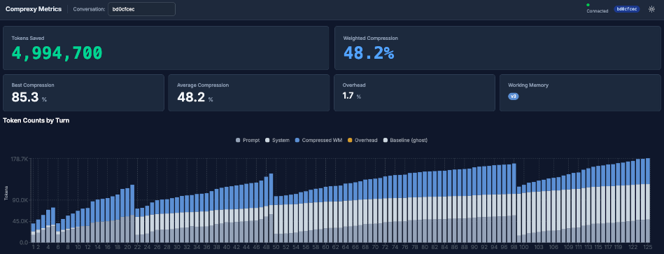

# Evidence: 5ca87ca

## Commit
`5ca87ca09c2d82ab3dbcd56d015c9dcbcf178850`

## Description
wip: initial implementation of dashboard and tests

## Conversation
`bd0cfcec-d141-42a8-8495-1b9f528f334f` (Qwen-35B)

## Content

Validated long-context compression across a 125-turn development workflow continuing the Comprexy Metrics Dashboard under `apps/dashboard/` (layout spacing, chart height, and bar-chart x-axis label clearance). In this local-LLM setup (Qwen-35B), actual upstream prompts stayed roughly 15–60k after working-memory folds while baselines climbed to 124k by turn 125.

### Coverage note

Telemetry for this conversation id covers only the parent agent session proxied through Comprexy. Spawned subagents (Task / cloud runners and similar) are separate conversations or outbound paths and are **not** included in the turn totals, baselines, or savings below. Actual tokens generated for the full workflow — parent plus subagents — are therefore higher than these figures.

### Validity note

Turns whose estimated baseline reached **256k tokens or more** are treated as **invalid for final analysis**. No turn in this conversation reached that threshold, so the full run is valid for final proof.

| Scope | Turns | Baseline threshold |
|---|---|---|
| **Totals (all turns)** | 1–125 | included |
| **Invalid for final analysis** | none | baseline ≥ 256k |
| **Final analysis turn** | 125 | last turn (all baselines &lt; 256k) |

Per-turn phase tables below use the bounded `TurnIndex`-ordered sample (turns 1–100 of 125; `IsPartialTurnSample`). Whole-conversation totals and the final-turn snapshot use all 125 turns.

### Totals (all 125 turns)

The run accumulated an estimated 10.35M baseline tokens across all turns. Comprexy reduced the sent-equivalent workload to 5.19M tokens. After accounting for 174,538 compression overhead tokens, the rollup net savings were approximately 4.99M tokens, or 48.24% of the baseline.

This represents:

- 48.24% weighted average token savings across the full workflow
- 44.13% simple average savings ratio across all turns
- 42.91% median savings ratio across all turns
- Peak observed savings 85.29% (turn 99; first turn of WM v3)
- Working memory advanced through version 3 by turn 125

### Dashboard snapshot

The chart shows the three working-memory folds as sharp drops in sent-equivalent height (around turns 22, 50, and 99), with baseline ghost outlines continuing to climb.

### Final analysis (turn 125)

Last turn of the conversation (all turns under the 256k baseline threshold):

- 55.85% savings on the final analysis turn
- 69,427 tokens saved on that turn alone
- Payload reduction from 124,311 estimated baseline tokens to 54,884 compressed tokens
- Message reduction from 247 raw messages to 76 sent messages
- Working memory version 3 active
- Soft budget and trim: trim not triggered on the final turn

Peak compression in the sampled window: **85.29%** at turn 99 (104,004 → 15,295 tokens; 195 raw → 8 sent; WM v3).

### Compression Phases (sampled turns 1–100)

| Phase | Turns | Baseline Tokens | Net Saved | Weighted Savings |
|---|---|---|---|---|
| **early_pre_working_memory** | 1–21 | 796,613 | -35,758 | -4.49% |
| **working_memory_v1** | 22–49 | 1,872,201 | 727,322 | 38.85% |
| **working_memory_v2** | 50–98 | 4,568,006 | 2,363,844 | 51.75% |
| **working_memory_v3** | 99–100 | 209,749 | 177,279 | 84.52% |

Working memory adoption was the dominant compression driver. The pre-WM phase ran slightly negative (−4.49%) while the cold start climbed toward a 58.1k actual prompt at turn 21. Each fold reset the upstream window (turn 22 → 16.1k; turn 50 → 18.2k; turn 99 → 14.8k). WM v3 continued through unsampled turns 101–125 and was still active on the final turn.

### Key Observations

1. **Continuous dashboard workflow across 125 parent-session turns**: layout and chart polish with upstream prompts typically 15–60k after folds (64k soft-limit configuration). Subagent token usage is outside this evidence set.

2. **Three working memory versions**: first fold at turn 22 (WM v1); WM v2 from turn 50; WM v3 from turn 99 through the final turn.

3. **Prompt growth stayed bounded after folds**: actual prompt tokens peaked at 59,970 on turn 49 (end of WM v1, still under 64k), then dropped to ~18k after the WM v2 fold and ~15k after the WM v3 fold. Without compression, baselines reached 124k by turn 125.

4. **Soft budget pressure was intermittent; hard trim never fired**: soft budget first exceeded at turn 4; 5 of 100 sampled turns exceeded soft (turns 4–5, 21, 49, 98). No hard-budget or trim events.

5. **No open tool chains at conversation end**: all tool calls were matched and completed.

### Final Analysis Snapshot (turn 125)

- **Turn 125**: 124,311 baseline tokens compressed to 54,884 tokens (55.85% savings)
- 247 raw messages reduced to 76 sent messages
- Working memory version 3 active
- Trim not triggered
